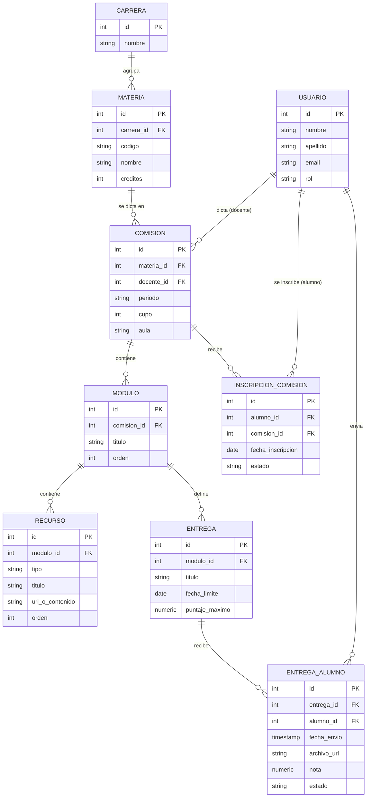

# Proceso 01 · Gestión de cursos y contenidos

Modela cómo se organiza una materia en comisiones, módulos de contenido y
entregas. Es la base sobre la que después se enganchan los otros procesos
(inscripciones, mesas de examen, legajo).

Referencias tomadas del dossier de plataformas: el modelo curso → sección →
actividad de **Moodle** y curso → batch → lección de **Frappe LMS**.

## Actores

| Actor | Puede hacer |
|---|---|
| Alumno | Inscribirse a una comisión, ver módulos y recursos, subir entregas |
| Docente | Crear/editar módulos y recursos de sus comisiones, definir entregas, corregir |
| Administrativo | Dar de alta materias, abrir comisiones, asignar docente y cupo |

## Modelo de datos

## Diccionario de entidades

**carrera** — agrupador de materias (Ingeniería, Licenciatura, etc.). Mínimo
necesario para este proceso; el modelo completo de plan de estudios vive en
el proceso de legajo/ERP.

**materia** — el catálogo de la asignatura (código, nombre, créditos),
independiente del período en que se dicta.

**comision** — la instancia real de la materia en un período concreto: quién
la dicta, cupo, aula. Es lo que un alumno cursa. `estado` de la inscripción
vive en `inscripcion_comision`, no acá.

**modulo** — unidad de contenido dentro de una comisión (equivalente a
"sección/tema" en Moodle). Tiene un `orden` para la secuencia.

**recurso** — material dentro de un módulo: archivo, video, link o texto.

**entrega** — tarea definida por el docente dentro de un módulo, con fecha
límite y puntaje máximo.

**inscripcion_comision** — vínculo alumno–comisión. `estado`:
`activa | abandonada | aprobada | desaprobada`. Es el punto de enganche con
el proceso de inscripciones (Expediente 02 del dossier).

**entrega_alumno** — lo que un alumno efectivamente entrega para una
`entrega`, con nota y estado (`pendiente | entregado | corregido`).

**usuario** — tabla única con `rol` (`alumno | docente | administrativo`).
Se resolvió como rol simple en vez de tablas separadas para no duplicar
datos de contacto; si más adelante un usuario necesita más de un rol
(ayudante que también cursa), se puede migrar a una tabla puente
`usuario_rol` sin romper el resto del modelo.

## Reglas de negocio

1. Un alumno solo puede subir una `entrega_alumno` si tiene una
   `inscripcion_comision` en estado `activa` para la comisión dueña de esa
   entrega.
2. Un docente solo puede crear/editar `modulo`, `recurso` y `entrega` en
   comisiones donde figura como `docente_id`.
3. `fecha_envio` posterior a `fecha_limite` no bloquea la entrega a nivel de
   datos (se registra igual); la política de entrega tardía es una regla de
   aplicación, no de esquema.
4. El `cupo` de una comisión es un tope soft: se valida al crear la
   inscripción, no con un constraint de base de datos, porque las
   excepciones (ampliar cupo) son una decisión administrativa frecuente.

## Fuera de alcance de este documento

Correlatividades, mesas de examen y legajo académico se modelan en
procesos separados y se enganchan a través de `materia` y
`inscripcion_comision`.
