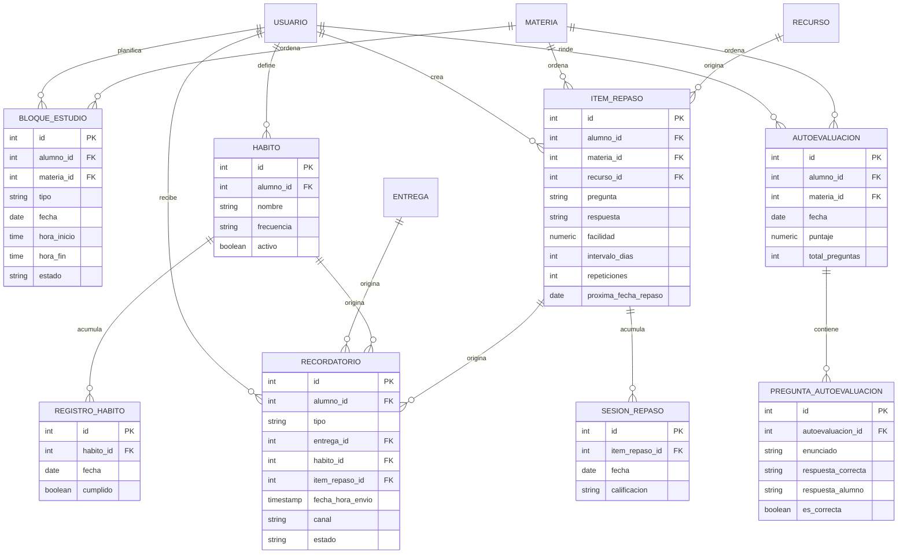

# Proceso 02 · Productividad y desempeño del estudiante

Cubre las cuatro funciones acordadas: planificador de horas de estudio,
recordatorios/hábitos, seguimiento de desempeño y preparación activa para
exámenes (repaso espaciado + autoevaluaciones). Es un módulo aparte de la
gestión institucional (Proceso 01); se engancha a él solo para leer datos
(`materia`, `entrega`, `entrega_alumno`, `recurso`), nunca para duplicarlos.

## Actor

**Alumno** es el único actor humano de este proceso: arma su plan de
estudio, define hábitos, repasa y se autoevalúa. El otro "actor" es el
**scheduler** (Celery beat) que corre jobs periódicos para generar
recordatorios y recalcular próximos repasos — no hay intervención de
docente ni administrativo acá.

## Modelo de datos

`USUARIO`, `MATERIA`, `RECURSO` y `ENTREGA` son las entidades del Proceso 01
(gestión de cursos y contenidos); no se redefinen acá.

## Diccionario de entidades

**bloque_estudio** — un bloque de tiempo que el alumno se asigna para
estudiar, repasar o encarar una entrega/examen. `tipo`:
`estudio | repaso | entrega | examen`. `estado`:
`planificado | cumplido | salteado` (autoreportado por el alumno, no
verificable por el sistema).

**habito** — una rutina que el alumno quiere sostener (ej. "repasar 30 min
por día"). `frecuencia`: `diaria | semanal | dias_especificos`.

**registro_habito** — marca diaria de si el hábito se cumplió. La racha
("streak") se calcula a partir de esta tabla, no se guarda como campo
aparte para no tener un valor que se desincroniza del historial real.

**item_repaso** — una unidad de repaso espaciado (tipo flashcard),
opcionalmente originada en un `recurso` del Proceso 01. `facilidad`,
`intervalo_dias`, `repeticiones` y `proxima_fecha_repaso` son el estado del
algoritmo de repetición espaciada (SM-2 simplificado).

**sesion_repaso** — cada vez que el alumno repasa un `item_repaso`.
`calificacion`: `otra_vez | dificil | bien | facil`. Cada sesión dispara el
recálculo de `facilidad`/`intervalo_dias`/`proxima_fecha_repaso` en el
`item_repaso` padre.

**autoevaluacion** / **pregunta_autoevaluacion** — un test que el alumno se
arma (o le proponen) sobre una materia, con sus preguntas, la respuesta
correcta y lo que el alumno respondió.

**recordatorio** — notificación programada. `tipo`:
`entrega_proxima | examen_proximo | habito | repaso_espaciado`. Solo una de
`entrega_id` / `habito_id` / `item_repaso_id` está completa según el
`tipo`; no se modela una tabla de recordatorios distinta por tipo porque el
volumen de campos propios de cada uno es mínimo.

## Seguimiento de desempeño: no es una tabla nueva

El "seguimiento de desempeño" (dashboard de notas/entregas por alumno y
materia) se resuelve con una **consulta agregada sobre `entrega_alumno`**
(Proceso 01) agrupada por `materia`: promedio de `nota`, porcentaje de
entregas a tiempo, tendencia en el tiempo. No se crea una tabla
`indicador_desempeno`: guardar ahí una nota que ya vive en
`entrega_alumno` duplicaría el dato y lo desincronizaría apenas alguien
corrija una entrega.

## Reglas de negocio

1. `proxima_fecha_repaso`, `facilidad` e `intervalo_dias` de un
   `item_repaso` solo se actualizan como efecto de una `sesion_repaso`
   nueva — nunca se editan a mano.
2. Los `recordatorio` los genera un job periódico (Celery beat), no una
   acción del alumno: entrega que vence en las próximas 24hs, hábito no
   cumplido el día anterior, o `item_repaso` con `proxima_fecha_repaso` =
   hoy.
3. Un `bloque_estudio` en estado `cumplido` es autoreportado; el sistema no
   verifica que el alumno haya estudiado realmente, solo registra la
   intención cumplida para alimentar el seguimiento de constancia.
4. `materia_id` es opcional en `bloque_estudio` e `item_repaso`: un bloque
   de estudio general (ej. "organizar la semana") no necesita atarse a una
   materia puntual.

## Fuera de alcance de este documento

Generación automática de preguntas de autoevaluación o de flashcards a
partir de contenido (vía IA) — acá solo se modela la carga explícita y el
resultado. Se puede sumar después sin tocar este esquema: entraría como un
proceso de creación de `item_repaso`/`pregunta_autoevaluacion`, no como un
cambio de modelo.
