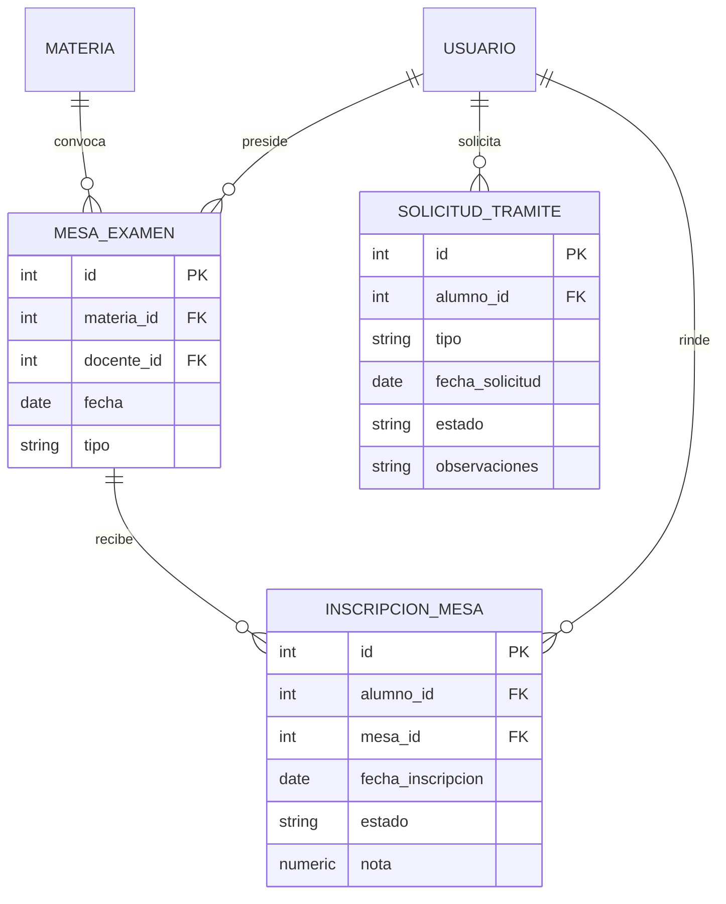

# Proceso 03 · Mesas de examen, legajo y trámites

Cierra el conjunto de procesos institucionales que quedaron pendientes
del dossier inicial (Expediente 02): inscripción a finales, y los
trámites administrativos de certificados. El legajo/historia académica
no se modela como entidad nueva — ver más abajo.

## Actores

| Actor | Puede hacer |
|---|---|
| Alumno | Inscribirse a una mesa de examen, ver su historial, solicitar certificados |
| Docente | Figurar como presidente de una mesa, cargar nota/resultado de sus mesas |
| Administrativo | Convocar mesas, resolver (emitir/rechazar) solicitudes de trámite |

## Modelo de datos

`MATERIA` y `USUARIO` son entidades del Proceso 01; no se redefinen acá.

## Diccionario de entidades

**mesa_examen** — una convocatoria a examen final de una materia, en una
fecha, con un docente a cargo (`docente_id`, el "presidente de mesa").
`tipo`: `final | recuperatorio`.

**inscripcion_mesa** — el alumno anotado a rendir una mesa concreta.
`estado`: `inscripto | ausente | aprobado | desaprobado`. `nota` solo
tiene sentido cuando el estado es `aprobado`/`desaprobado`.

**solicitud_tramite** — un pedido administrativo del alumno (certificado
de alumno regular, analítico, constancia de título en trámite). `tipo`:
`certificado_alumno_regular | certificado_analitico | constancia_titulo_en_tramite`.
`estado`: `pendiente | emitido | rechazado`.

## El legajo no es una tabla nueva

Igual que el "seguimiento de desempeño" del Proceso 02, la historia
académica de un alumno (qué aprobó, con qué nota) se resuelve con una
**consulta agregada**: `inscripcion_comision` con `estado=aprobada`
(Proceso 01) unida a `inscripcion_mesa` con `estado=aprobado` (acá),
agrupada por alumno y materia. No se crea una tabla `legajo` porque
duplicaría notas que ya viven en esas dos tablas y se desincronizaría
apenas alguien corrija una.

## Reglas de negocio

1. La `nota` y el `estado` de una `inscripcion_mesa` solo los carga el
   `docente_id` que preside esa `mesa_examen` (o un administrativo) —
   mismo patrón que la corrección de `entrega_alumno` en el Proceso 01.
2. Una `solicitud_tramite` solo la resuelve (pasar a `emitido` o
   `rechazado`) un administrativo; el alumno solo puede crearla y
   verla, no cambiar su estado.
3. Para inscribirse a una `mesa_examen`, alcanza con que el alumno
   tenga (o haya tenido) una `inscripcion_comision` de esa materia. No
   se validan correlatividades formales todavía — ver "Fuera de
   alcance".

## Fuera de alcance de este documento

- **Correlatividades**: validar que el alumno cursó/aprobó las materias
  prerrequisito antes de dejarlo inscribirse a una mesa. La malla
  curricular cargada (Proceso 01) no incluye ese grafo todavía.
- **Emisión real del certificado** (generar el PDF): acá solo se
  registra el trámite y su estado, no el documento en sí.
