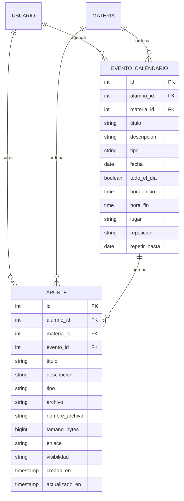

# Proceso 04 · Calendario personal y biblioteca de apuntes

Cubre las dos funciones que el alumno pidió: **armar un calendario** con su
cursada y sus fechas, y **subir los apuntes y grabaciones** que produce en la
universidad. Es un módulo personal, como el Proceso 02: se engancha a la
gestión institucional (Proceso 01) y a las mesas (Proceso 03) solo para
**leer** fechas que ya existen, nunca para duplicarlas.

## Actor

**Alumno** es el único actor: crea sus eventos, sube sus archivos y decide si
los comparte con su comisión. El **docente** puede usar las mismas pantallas
para su propio material, pero no hay acá ninguna acción institucional (no se
califica ni se publica contenido oficial de la cursada: eso es el `recurso`
del Proceso 01).

## Modelo de datos

`USUARIO` y `MATERIA` son entidades del Proceso 01; no se redefinen acá.

## Diccionario de entidades

**evento_calendario** — una entrada del calendario del alumno. `tipo`:
`clase | parcial | final | entrega | personal`. Si `todo_el_dia` es verdadero,
`hora_inicio`/`hora_fin` van en `NULL`; si no, ambas son obligatorias y
`hora_fin > hora_inicio`. `repeticion`: `ninguna | semanal`; una cursada que
va todos los martes es **una sola fila** con `repeticion='semanal'` y
`repetir_hasta` = fin del cuatrimestre.

**apunte** — un archivo (o enlace) que el alumno produjo: la foto de la
carpeta, el PDF de la clase, la grabación del teórico. `tipo`:
`apunte | grabacion | enlace`. Guarda **o** `archivo` **o** `enlace`, nunca
ninguno de los dos. `nombre_archivo` conserva el nombre original porque en
disco se guarda con un nombre opaco (`apuntes/<alumno_id>/<uuid>.<ext>`).
`visibilidad`: `privado | comision`.

## La vista del calendario no es una tabla

`GET /api/agenda/?desde=&hasta=` devuelve el calendario **unificado**, armado
en memoria a partir de cuatro fuentes:

| origen           | de dónde sale                                              | editable |
| ---------------- | ---------------------------------------------------------- | -------- |
| `evento`         | `evento_calendario` (Proceso 04)                           | sí       |
| `bloque_estudio` | `bloque_estudio` del planificador (Proceso 02)             | no       |
| `entrega`        | `entrega.fecha_limite` de sus comisiones activas (Proc. 01) | no       |
| `mesa_examen`    | `mesa_examen` donde tiene `inscripcion_mesa` (Proceso 03)  | no       |

No se copia nada a una tabla "calendario": una fecha límite que el docente
mueve tiene que aparecer movida en el calendario del alumno el mismo día, y
eso solo se logra leyéndola de su tabla original. Las ocurrencias de un
evento semanal tampoco se materializan: se expanden al consultar
(`EventoCalendario.ocurrencias`).

## Reglas de negocio

1. Todo lo de este proceso es **personal**: cada usuario solo ve y edita sus
   propios eventos y apuntes. La única excepción es la lectura de apuntes con
   `visibilidad='comision'`.
2. Un apunte compartido lo ven los usuarios que **comparten materia**: los
   alumnos con `inscripcion_comision` activa de esa materia y el docente que
   la dicta. Compartir exige `materia_id`; sin materia no hay con quién
   compartir.
3. Solo el autor edita, comparte o borra su apunte. Un compañero que lo ve
   compartido solo puede leerlo y descargarlo.
4. Los archivos **no se sirven por `MEDIA_URL`**. Se descargan por
   `GET /api/apuntes/<id>/archivo/`, que aplica las reglas 1 y 2. Por eso la
   ruta en disco además es impredecible (UUID): que un archivo no sea público
   no puede depender de que nadie adivine la URL.
5. Se validan **extensión** (lista blanca de formatos de apunte y de
   audio/video) y **tamaño** (`APUNTES_TAMANO_MAXIMO_MB`, 200 MB por defecto).
   Para una grabación más pesada, el camino es `tipo='enlace'`.
6. `materia_id` y `evento_id` son opcionales en `apunte`: se puede subir algo
   suelto y clasificarlo después. Si se borra el evento vinculado, el apunte
   sobrevive con `evento_id = NULL`.

## Fuera de alcance de este documento

- **Grabar audio desde el navegador**: acá solo se sube un archivo ya
  existente. Sumarlo después no cambia el modelo — sería otra forma de
  producir el mismo `POST /api/apuntes/`.
- **Almacenamiento en la nube (S3)**: `archivo` es un `FileField`, así que
  migrar a S3 es cambiar el backend de storage en `settings.py`, sin tocar el
  esquema ni la API.
- **Repeticiones complejas** (día por medio, "los martes y jueves", excepciones
  por feriado): hoy solo hay `ninguna | semanal`. Un evento que cae dos días
  distintos se carga como dos eventos semanales.
- **Búsqueda dentro del contenido** de los apuntes (OCR/transcripción): se
  busca por título, materia y tipo, no por lo que dice adentro.
